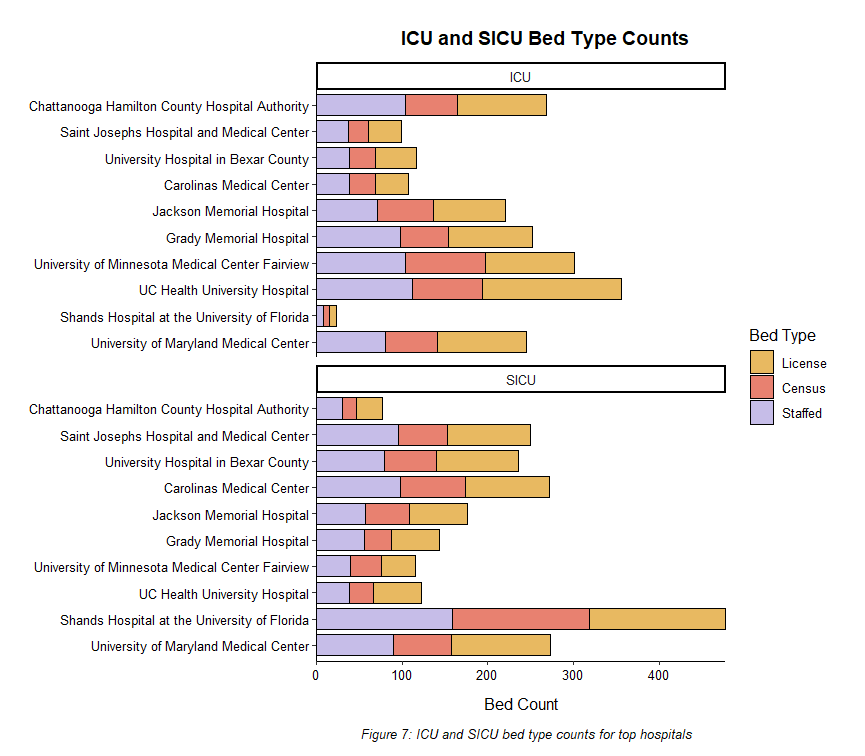
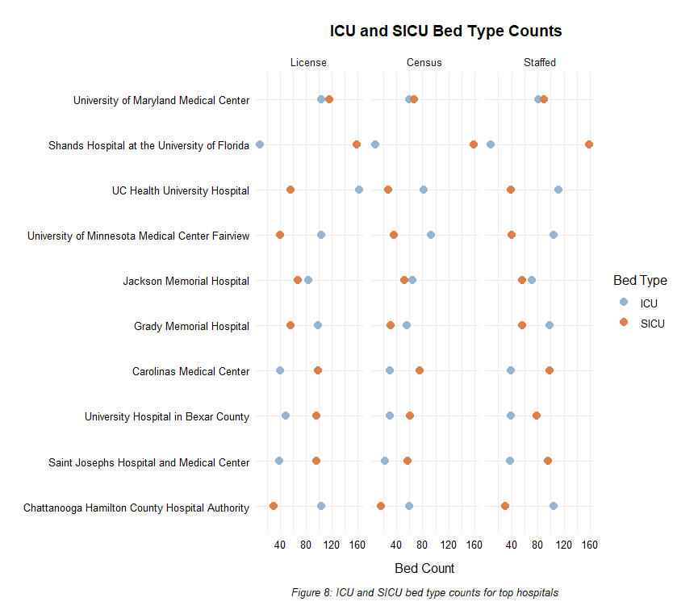

# hospital-bed-supply

This project addresses a real-life problem healthcare organizations face when considering bed staffing needs in hospitals. A .Rmd report was created to analyze bed volume based on several factors. 

